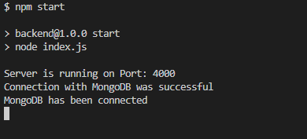
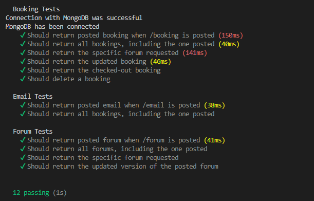
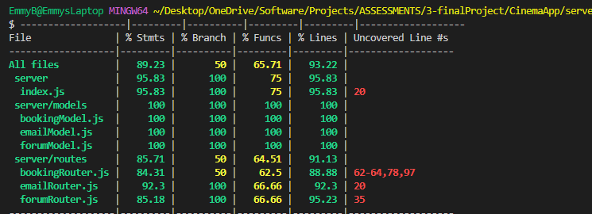
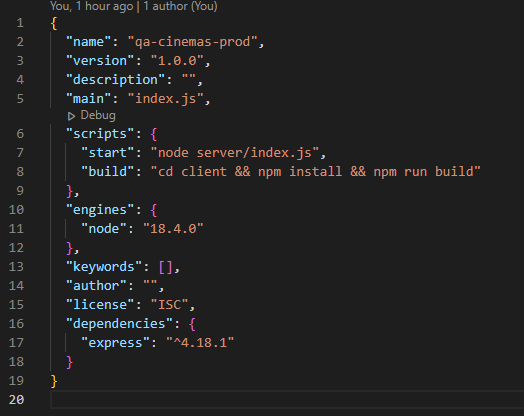
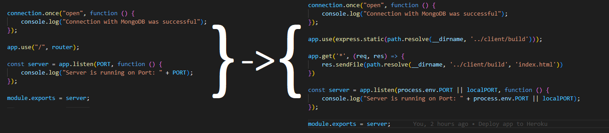
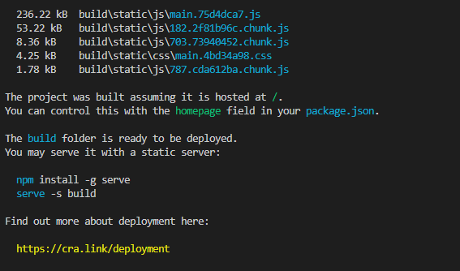
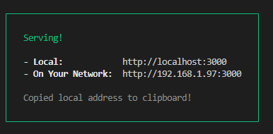

#### Coverage: 93.22%
# $QA$ $Cinemas$
*This product was developed as part of our training with QA and meets the scope and requirements for the QA Core Project*

A MERN stack web application developed for QA Cinemas to showcase their listings, venue information, to book tickets, and provide further information.

### Visit our website @ [qa-cinemas.herokuapp.com](https://qa-cinemas.herokuapp.com/)

---
## $Getting$ $Started$
### Pre-requisites

* [Node.js](https://nodejs.org/en/) and [(npm)](https://www.npmjs.com/) - package management and built tool
* [React.js](https://reactjs.org/) - front end, reactive development
* [MongoDB](https://www.mongodb.com/) or an [Atlas Realm](https://realm.mongodb.com/) account - databasing

---
## $Installing$
1. Fork this repository
2. Clone the forked repo on your local machine:
```
git remote add origin <url>
```
3. Navigate to the 'client' directory either using your file explorer or CLI
```
  cd client
```
4. Install the dependencies using
```
npm install
```
5. Navigate to the server folder using either a file explorer or CLI and repeat
```
cd ../server
npm install
```
---
6. You can run the frontend locally by navigating into the client folder and executing
```
npm start
```
Once the webpack has compiled successfully, you should see the following output in your terminal


7. You can also run the backend locally at the same time by navigating into the server folder and running
```
npm start
```
Once the server has connected successfully, you should see



From here, your frontend and API are connected and able to communicate; you can access the webapp at [http://localhost:3000](http://localhost:3000) if it doesn't load automatically

---
## $Running$ $the$ $Tests$
For this product, several intergration tests have been included and are located in
```
CinemaApp/server/tests
```
Which test the bookingRouter, emailRouter, and forumRouter. All of these can be run from the server directory 
with the command
```
npm test
```
As well as with a full coverage report using
```
npm run coverage
```
Generated by istanbul. Coverage reports will be generated both as a text output in the console, and as a static
html file (located in server/.nyc_output and server/coverage respectively).

In total, there are 12 tests run which cover 93.22% of the code, as shown below:



##### NB: *Tests clear out the database at the start and end of each running: it is advised to use either a mock database or ensure any important data is backed up prior to running tests*

---
## $Deployment$
To deploy the web application locally, cd into the root folder (CinemaApp) and run
```
npm init -y
```
It is then also advised to run
```
npm install
```
In this directory. You should see a package.json file and the node_modules directory appear. Within the package.json, amend the scripts as follows:
```
"scripts" : {
  "start": "node server/index.js",
  "build": "cd client && npm install && npm run build"
}
```
It is also advised to specify the engine (node). You can check your node version by running
```
node -v
```
from the command line, then adding your node version to package.json like so:
```
"engines":{
  "node": "you-node-version"
}
```
The result should look something like this:



Then, you will need to amend the server/index.js file. Firstly, at the top of the file declare a path const

```
const path = require('path');
```
Then, amend the app.use statement and add an additional app.get before the app.listen process, like so:

```
app.use(express.static(path.resolve(__dirname, '../client/build')));

app.get('*', (req, res) => {
    res.sendFile(path.resolve(__dirname, '../client/build', 'index.html'))
})

const server = app.listen(process.env.PORT || localPORT, function () {
    console.log("Server is running on Port: " + process.env.PORT || localPORT);
});

module.exports = server;
```
Meaning your index.js has now changed ready to use the build:



You can then choose to either **deploy and serve the build locally**, or **deploy and host the build with [Heroku](https://www.heroku.com)**

### 1. Local Deployment
If deploying locally, open the command line and make sure you're in the root directory. Then, run
```
npm run build
```
And wait until you see the output confirming your build has been successful:



As shown in the output, you can serve it with a static server using
```
npm i -g serve
serve -s client/build
```
You should then see the following output as well as being able to access your local serve at http://localhost:3000



and be able to access the complete build locally!

### 2. Heroku Deployment
Alternatively, you can host the site on Heroku rather than locally. Firstly, you will need an account with Heroku which can be created for free. Heroku will then prompt you to create a new app; simply choose the name a deployment region.
Once set up, start in the root directory and install heroku and, once it has finished installing, login to your account from the CLI:
```
npm i -g heroku
heroku login
```

Next, ensure that your project is not currently in a repo: to do so, you can either delete the '.git' file, or you can copy and paste your build into another folder on your local machine. This is because you will need to initialise it as a heroku repo, using:
```
git init
heroku git:clone -a [your-app-name]
cd [your-app-name]
```
Ensure you are happy with the current state of the application, then run
```
git add .
git commit -am "Deploy to Heroku"
git push heroku master
```
Once completed, you will be informed both in the terminal as well as the deployments tab for your app on the website. You can then simply click "open app" on Heroku, or visit [your-app-name].herokuapp.com.

If you have any issues, or your app does not seem to work, you can run
```
heroku logs --tail
```
from the command line to get a breakdown of what has happened, debug, and then redeploy!

That's it! You now have the app deployed and hosted either locally, or through heroku!

## $Built$ $with$
* [MongoDB Realm](https://realm.mongodb.com/) - Cloud Database
* [Express](https://expressjs.com/) - API and Middelware
* [React](https://reactjs.org/) - Reactive Frontend/Client
* [Node](https://nodejs.org/) - Package Management and Build tool
* [Heroku](https://dashboard.heroku.com/) - Hosting online
* [GitHub](https://www.github.com) - Versioning and Heroku deployment support

## $Versioning$
* We have used [Semver](http://semver.org/) versioning

## $Authors$
* **Emily Bradfield** - *initial work* - [emmy-bradfield](https://www.github.come/emmy-bradfield)
* **Ibraheem Latif** - *initial work* - [ibraheem-latif](https://github.com/ibraheem-latif)
* **Jabril Yusuf** - *initial work* - [Jib-Yusuf](https://github.com/Jib-Yusuf)
* **Madeha Rawshon** - *initial work* - [Madeha98](https://github.com/Madeha98)
* **Michael King** - *initial work* - [MichaelKing674](https://github.com/MichaelKing674)
* **Shahmeen Shaikh** - *initial work* - [shahmeen-shaikh](https://github.com/shahmeen-shaikh/)

## $Acknowledgements$
Thanks to our trainers at QA over the past few weeks for the continual support and guidance with developing this project.
